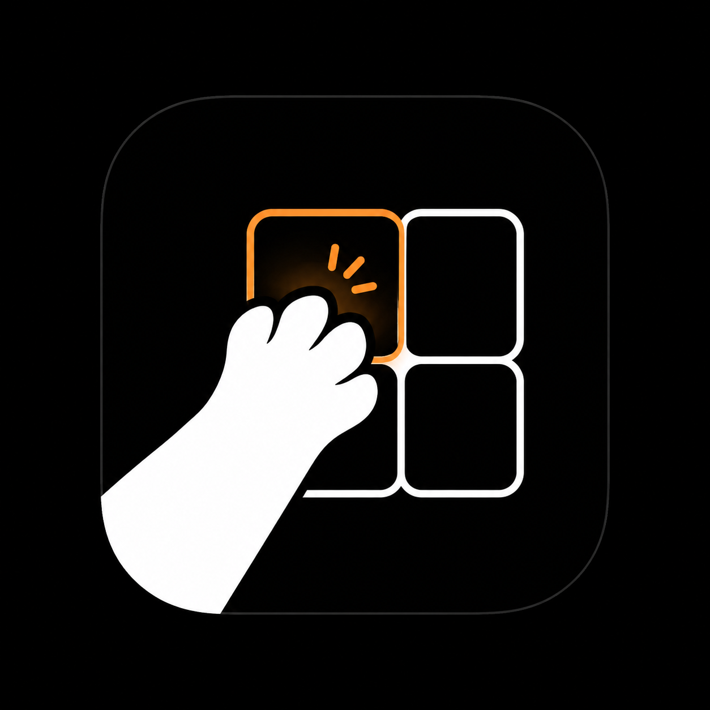

# 屏分分 · tuck

**按住 Ctrl,窗口各就各位。**

极简的 macOS 菜单栏窗口分屏器,专为多 Agent / vibe-coding 工作流设计。
没有组合键,没有要背的东西。

[**↓ 下载最新版**](https://github.com/pakco77/tuck/releases/latest) · [**官网 / 在线演示**](https://tuck.pakcochan.com)

[English](README.md) | **中文**

---

## 这是什么

tuck 是一个住在 macOS 菜单栏里的极简窗口分屏器。

按住触发键(默认 `Ctrl`),屏幕上浮现分屏布局;移动鼠标选区,松手——当前窗口就贴到那一格。没有快捷键组合要背,没有复杂配置。

> 👉 **动态演示**就在官网首屏:[tuck.pakcochan.com](https://tuck.pakcochan.com)

## 为什么用它

- **20+ 分屏布局** — 全屏 / 2 / 3 / 4 分及大量变体(左右、三列、田字、左窄右大……),按 `←` `→` 切布局,`↑` `↓` 切变体。
- **触发键可自定义** — 默认按住 `Ctrl`,嫌冲突可在菜单里换成别的键。
- **适配多显示器** — 每块屏幕记住各自的布局,外接屏、笔记本屏互不干扰。
- **一键全屏** — `Ctrl + Space` 把当前窗口直接铺满。
- **占位即置换** — 目标格已有窗口时,两个窗口自动对调位置。

## 安装

1. 到 [Releases](https://github.com/pakco77/tuck/releases/latest) 下载 `tuck.dmg`
2. 打开 dmg,把 **tuck** 拖进「应用程序」
3. 启动 tuck(已 Apple 公证,不会被 Gatekeeper 拦)

### ⚠️ 首次启动必须授权两个权限

tuck 要移动窗口、要监听你按下的触发键,所以需要:

| 权限 | 路径 | 作用 |
| --- | --- | --- |
| **辅助功能** | 系统设置 → 隐私与安全性 → 辅助功能 | 允许 tuck 移动 / 缩放窗口 |
| **输入监控** | 系统设置 → 隐私与安全性 → 输入监控 | 允许 tuck 感知你按住触发键 |

把这两项里的 tuck 开关打开即可。**没授权的话,按 Ctrl 不会有任何反应**——这不是 bug。

## 价格

核心功能**永久免费**:全屏 / 2 / 3 / 4 分,以及全部变体。

5 分、6 分等更密集的布局是可选的一次性 Pro 解锁,买断永久使用(即将上线)。

## 隐私

tuck 完全在本地运行:不收集、不上传你的任何数据、文件或窗口内容。你的触发键偏好和各屏布局只存在你自己的设备上。

详见 [隐私政策](https://tuck.pakcochan.com/privacy.html) · [服务条款](https://tuck.pakcochan.com/terms.html) · [退款政策](https://tuck.pakcochan.com/refunds.html)

## 系统要求

macOS(Apple Silicon)。

---

Made by Pakco · <a href="https://tuck.pakcochan.com">tuck.pakcochan.com</a>

